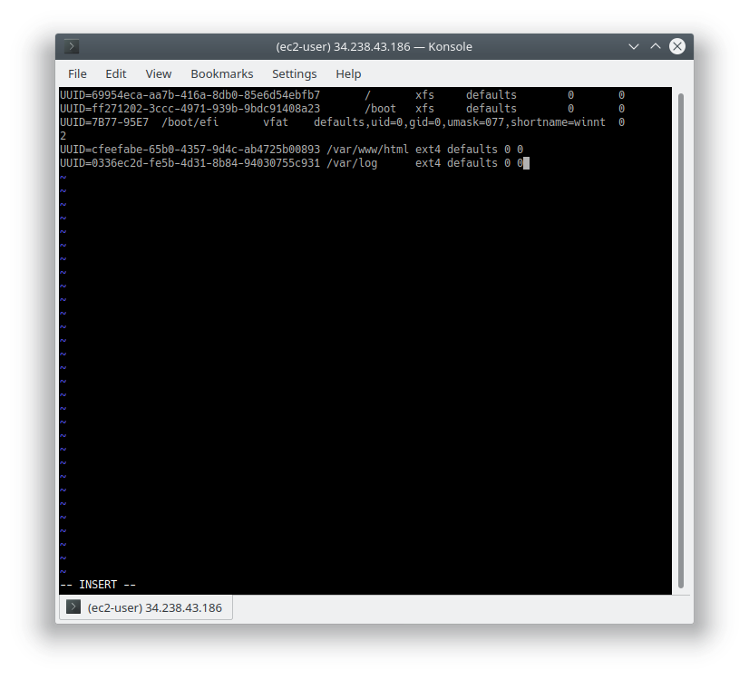

#### Implementing web solution in wordpress of RED HAT LINUX MACHINE
#### Project 6 of Banjo Babade @ Darey.io DevOps training
#### this practicals also covers the use of gdisk to add partitions to AWS EBS 'Elastic Block Storage' to my EC2 Instance. and the implementation of  of a three tier Archutecture of web solutions

#### A THREE TEIR MODEL AND IMPLEMENTATION OF A WEB SOLUTION WITH WORDPRESS 
![3 teir Presentation]](Screenshot_20230106_171447.png)
## 1 CREATION AND CONFIGURATION OF WEB-SERVER

I created three EDS of 10GB volume for each server  then attach them to the AWS ec2 instances(both Web-server and database-server)
#### NOTE: {remember to choose location(zone) where your AWS server is when creating volumes so that it can be available for connectivity}

on the terminal, **lsblk** was used to list the block devices that were  that were newly attached,. they were displays as xvdg, xvdf, xvdh

than use **df -h** to see all mounts and free spaces on the intended server machine 
further. **sudo gdisk /dev/xvdf/** was used to creat single partition for each of the attached disk ie **sudo gdisk /dev/xvdg** and **sudo gdisk /dev/xvdh** on the first prompt 'command ? help"  use *p* , on the second prompt 'command ? help" *n* then press enter like thrice on the wizard, on the thrid prompt 'command ? help" *w*, then *y* for the last.

**lsblk** agin to see the changes(newly configured patition) I noticed xvdf1 , xvdg1, xvdh1 at this time
I Installed the  *lvm2* package using **sudo yum install lvm2** then I Run **sudo lvmdiskscan** command to check for available partitions.

Now the following commands which uses the *pvcreate* utility:
**sudo pvcreate /dev/xvdf1**
**sudo pvcreate /dev/xvdg1**
**sudo pvcreate /dev/xvdh1**
will make each of the disk a a Physical Volume (PV) so that is can be used by Logical Volume Manager (LVM).
verify that it was sucessful using **sudo pvs** 

Now it's time I created my Volume Group (VG) using the *vgcreate* utility so as to group all three(3) disks as one with the name : *webdata-vg*
**sudo vgcreate webdata-vg /dev/xvdh1 /dev/xvdg1 /dev/xvdhf**

use **sudo vgs** to verify the success of the (Volume Group )VG creation I should see <29.99 under the Vsize column

*lvcreate* utility to create the 2 Logical Volumes (LV) for (both apps and logs)out of the *webdata-vg* that was created recently which is now the Pysical Volume(PV)

**sudo lvcreate -n apps-lv -L 14G webdata-vg**
**sudo lvcreate -n logss-lv -L 14G webdata-vg**

verify the success with **sudo lvs**

To check for complete set and entire set up
**sudo vgdisplay -v #view complete setup - VG, PV, and LV sudo lsblk**

I use *mkfs.ext4* to format the logical volumes(LV) with ext4 filesystem.
**sudo mkfs -t ext4 /dev/webdata-vg/apps-lv**
**sudo mkfs -t ext4 /dev/webdata-vg/logss-lv**

I Created */var/www/html* directory to store website files
**sudo mkdir -p /var/www/html**

I Created */home/recovery/logs* to store backup of log data

**sudo mkdir -p /home/recovery/logs**

Mount */var/www/html on apps-lv* logical volume(LV)

**sudo mount /dev/webdata-vg/apps-lv /var/www/html/**

Using *rsync utility* to backup all the files in the log directory /var/log into /home/recovery/logs 
NB:(This is required before mounting the file system)
**sudo rsync -av /var/log/. /home/recovery/logs/**

Mounting */var/log on logs-lv logical volume(LV)*. (Note that all the existing data on /var/log will be deleted. and that was why *sudo rsync -av /var/log/. /home/recovery/logs/* performed previously above is important...

**sudo mount /dev/webdata-vg/logss-lv /var/log**

Restorring log files back into /var/log directory
**sudo rsync -av /home/recovery/logs/. /var/log**

**MPORTANT:**I *Update /etc/fstab file so that the mount configuration will persist after restart of the server*
Firstly do **sudo blkid** (maybeit block id) then copy the UUID in th following format

modify the /etc/fstab file with the copied UUID
**sudo vi /etc/fstab**

Testing the configuration and reloading the daemon
**sudo mount -a**
**sudo systemctl daemon.reload** 

**df -h** to view all devices, disk and volumes

********************************** ***********************************
## 2 CREATION. SETUP AND CONFIGURATION OF THE DADABASE SERVER 

I repeated the all same steps above for the DB server

 

But since it is a database server i created db-lv  and mounted it to the /db directory  as a prototype of apps-lv which was beign mounted on /var/www/html

I also created looggss-lv and mounted it to /var/log just excatly as it was in the case of the webserver
### Screenshots

******************************************  **********************************************
## 3 Going Back to my EC2 RED HAT LINUX Web-Server to install Wordpress, MYQSL-Client, Apache and its Dependencies

1. Install wget, Apache and its Dependencies
 **sudo yu -y update**
 **sudo yum -y install wget httpd php php-mysqlnd php-fpm php-json**

 2. Start Apache
**sudo systemctl enable httpd**
**sudo systemctl start httpd**

3. Install PHP and its ependencies
  **sudo yum install https://dl.fedoraproject.org/pub/epel/epel-release-latest-8.noarch.rpm**
 **sudo yum install yum-utils**
 **http://rpms.remirepo.net/enterprise/remi-release-8.rpm**
 **sudo yum module list php**
 **sudo yum module reset php**
 **sudo yum module enable php:remi-7.4**
 **sudo yum install php php-opcache php-gd php-curl php-mysqlnd**
 **sudo systemctl start php-fpm**
 **sudo systemctl enable php-fpm**
 **sudo setsebool -P httpd_execmem 1**

 4. Restart Apache
    **sudo systemctl restart httpd**

5. Download wordpress and copy wordpress to var/www/html

  **mkdir wordpress**
  **cd   wordpress**
  **sudo wget http://wordpress.org/latest.tar.gz**
  **sudo tar xzvf latest.tar.gz**
  **sudo rm -rf latest.tar.gz**
  **cp wordpress/wp-config-sample.php wordpress/wp-config.php**
  **cp -R wordpress /var/www/html/**

6. Configure SELinux Policies

  **sudo chown -R apache:apache /var/www/html/wordpress**
  **sudo chcon -t httpd_sys_rw_content_t /var/www/html/wordpress -R**
  **sudo setsebool -P httpd_can_network_connect=1**

******************************  **********************************************
## 4 BACK TO my AWS  RED HAT DB-SERVER EC2 Instance

1. Install mysql-server and start the server
**sudo yum update**
**sudo yum install mysql-server**
**sudo systemctl restart mysqld**
**sudo systemctl enable mysqld**

2. Configure DB to work with WordPress
**sudo mysql**
**CREATE DATABASE wordpress;**
**CREATE USER `banjo`@`172.31.93.131` IDENTIFIED BY 'password';**
**GRANT ALL ON wordpress.* TO 'banjo'@'172.31.93.131';**
**FLUSH PRIVILEGES;**
**SHOW DATABASES;**
**exit**

3. I open MySQL port 3306 on DB Server EC2. For extra security, you shall allow access to the DB server ONLY from your Web Server’s IP address, so in the Inbound Rule configuration specify source as /32
   

*************************************  ****************************************
## 5 Back to my WEBSERVER EC2 INSTANCE
1. Installing MYSQL-Client
**sudo yum install mysql**
**sudo mysql -u banjo -p -h 172.31.84.12** <---server-private-IP-Address
verify connection by **SHOW DATABASES;**

2. Enable TCP port 80 in Inbound Rules configuration for your Web Server EC2 (enable from everywhere 0.0.0.0/0 or from your workstation’s IP)

check for permissinon and configurations of wordpress if any

Try to access from your browser the link to your WordPress http://<Web-Server-Public-IP-Address>/wordpress/
        18.212.39.51 is my public IP in this case...
      
    
    
     
     

     ## Wow what a very long step to follow DevOps Journey but very very interesting 
     
     justbj@live.com | BANJO BABADE
     

